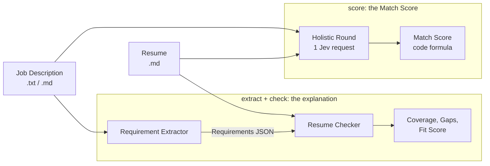
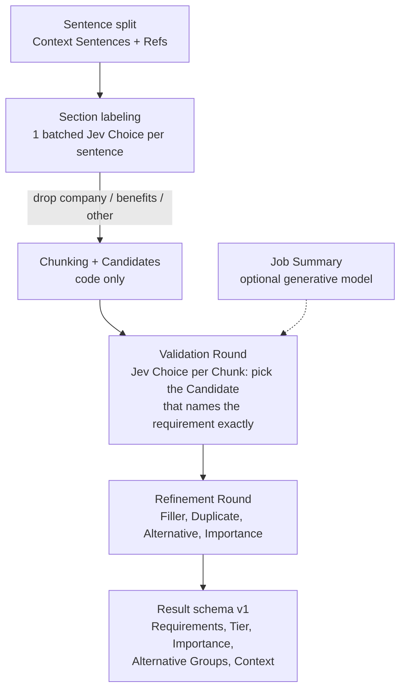
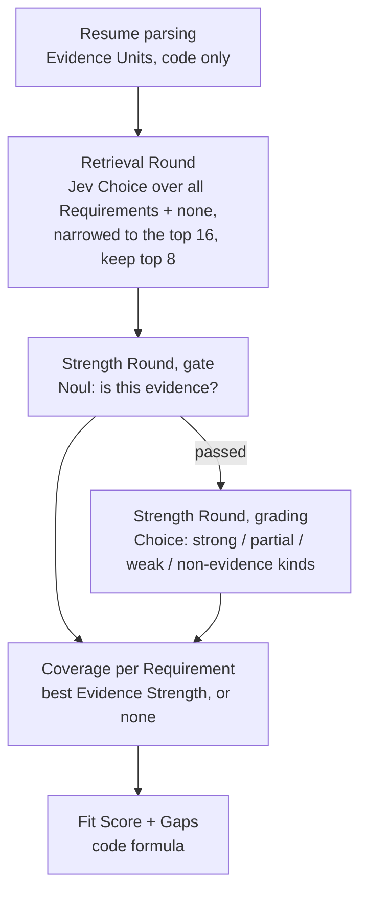
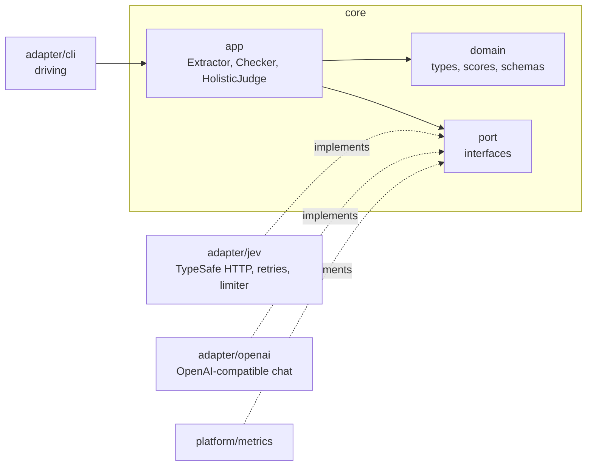

# Architecture

The tool answers "how well does this Resume fit this job, and why?" with
**Jev**, TypeSafe's System One model: a fast, typed classifier that returns
probabilities for Choice, Noul (yes/no) and Score questions instead of
generating text. Code asks narrow questions and combines the answers; no
generated text is ever parsed for a decision.

Domain terms (Requirement, Evidence Unit, Coverage, ...) are defined in
[`CONTEXT.md`](../CONTEXT.md). Decisions are in [`docs/adr/`](adr/).

## Three commands, two paths

- **Scoring path (`score`).** One Jev request over the whole posting and
  Resume asks three questions: `role_match` (Score), `experience_short`
  (Noul), `blocker` (Noul). `domain.MatchScore` maps them to 0–100 with
  fitted weights from `tuning/tuning.yaml`. See
  [ADR 0004](adr/0004-match-score-from-the-holistic-round.md).
- **Explanation path (`extract`, then `check`).** Finds what the employer
  asks for and which Resume lines show it. Not used for the score; it
  explains one.

## Requirement Extractor

Jev never judges a phrase in isolation: it selects among the Candidates of
one Chunk (plus rejection options), which prevents cut-off picks like
"financial" from "financial systems".

## Resume Checker

Only questions whose answer is used are asked, since Jev bills input
tokens. Skills and Summary lines are capped at weak. See
[ADR 0001](adr/0001-two-round-evidence-matching.md) and
[ADR 0002](adr/0002-fit-score-from-coverage.md).

## Code layout (hexagonal)

| Path | Role |
|---|---|
| `cmd/{extract,check,score,eval}` | Entry points. `wire.go` is the injector; `wire_gen.go` is generated (`make wire`). |
| `internal/domain` | Core types named after `CONTEXT.md`, the score formulas, output schemas, the trace. |
| `internal/port` | Interfaces the core depends on: `AIClassifierClient`, `AIGenerativeClient`, `Metrics`, and the driving ports. |
| `internal/app` | The pipelines, one method per stage, and the Jev question builders. |
| `internal/adapter/jev` | TypeSafe System One client; `jevtest` is the fake server used by every test. |
| `internal/adapter/openai` | OpenAI-compatible chat client (Job Summary, eval baseline). |
| `internal/adapter/gencache` | File cache for generated text, so eval inputs stay fixed. |
| `internal/adapter/eval` | Golden-set scoring, reports, miss attribution, the generative baseline arm. |
| `internal/adapter/cli` | Flag parsing, input limits, output writing. |
| `internal/platform` | `config` (env), `limiter`, `metrics`, `logging` (slog JSON), `fsutil` (private atomic writes), `providererr` (sanitized provider errors). |
| `internal/wiring` | Shared google/wire provider sets. |
| `tuning/` | `tuning.yaml` (every prompt and weight), embedded in the binaries. |

## Cross-cutting rules

- **Swappable providers.** The core sees only the port interfaces; tests
  plug in the fake Jev server and never touch the network.
- **Bounded concurrency.** Each AI client has its own limiter
  (`JEV_MAX_CONCURRENCY`, `GEN_MAX_CONCURRENCY`).
- **Observability.** Every stage logs with `slog` (JSON on stderr) and
  records counts, tokens, cost, and latency (p50/p95) through `Metrics`;
  the CLI prints a run summary.
- **Pinned prompts.** `TestPromptSnapshot` fails on any change to the
  requests the app sends; outputs record the tuning file's hash.
- **Bounded runs.** `RUN_DEADLINE` (default 120 s) and a 48 KiB input
  limit, since the posting and Resume share one Jev request (32k tokens on
  OpenRouter).
