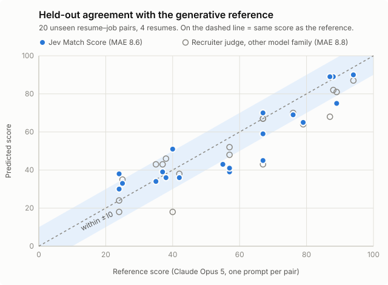

# How this project is evaluated

Three evals, one per question. All of them run against live Jev, write
dated reports to `eval/reports/`, and can be rescored offline after a label
edit. None of them run in `go test`, which never touches the network.

| Question | Command | Ground truth |
|---|---|---|
| Does the Match Score agree with a frontier model? | `make eval-e2e` | Generative reference scores (`testdata/reference`, `testdata/final`, `testdata/final2`) |
| Does `extract` find what the employer asks for? | `make eval` | Hand-labeled Requirements (`testdata/golden`) |
| Does `check` link the right resume lines? | `make eval-checker` | Hand-labeled Evidence Links (`testdata/checker`) |

## Match Score: agreement with the generative model approach

**Reference.** One Claude Opus 5 call per (resume, job) pair with a plain
one-prompt match score (0–100), saved once and never rescored. The goal is
to reproduce that judgment at a fraction of the cost and latency, not to
predict hiring outcomes.

**Metrics.** Mean absolute error (MAE) against the reference, share within
±10 points, largest misses, and Kendall τ-b, which measures whether the
pairs come out in the same order. 95% intervals are pair bootstraps (2,000
resamples).

**Sets.**

- *Development*: the 30-pair tuning subset of `testdata/reference` (one
  resume) and the former first sealed set (`testdata/final`, 20 pairs, 4
  resumes). Question wordings and weights were chosen here.
- *Sealed*: `testdata/final2`, 20 pairs and 4 resumes never used for
  tuning. Job picks were registered by title before anything was scored
  (`docs/final-set-2/picks.md`); synthetic resumes were written by a
  separate agent from a fixed prompt. A sealed set is scored once. After
  that it becomes development data, and the next claim needs a new one.

**Selection without overfitting.** Candidate question sets were compared
with resume-held-out cross-validation (fit on all resumes but one, test on
the one left out), because generalizing to new resumes is what failed
before. `scripts/probe_holistic.py` probes question wordings offline;
`scripts/fit_match.py` refits the weights.

**Second judge.** An independent recruiter rubric
(`.claude/skills/recruiter-judge`) on a different model family, 3 runs,
median, with a quote required for every must-have
(`scripts/judge.py`, `scripts/compare_judge.py`). It sees neither system's
score. It answers the question "is the reference itself the last word?":
on the sealed set the judge and Jev miss the reference by about the same
amount.

*Regenerate with `scripts/plot_agreement.py`.*

**How stable is the reference?** The same input called again: 1.1 points
from the 3-call median. The same pairs days later: +11.6 points on average.
The same resume as Markdown instead of JSON: 14.9 points lower. An 8.6-point
error sits inside that envelope. Results and limitations:
[final-report-v1.md](final-report-v1.md).

## Requirement Extractor

**Labels** (`testdata/golden`, rules in `testdata/golden/README.md`): about
20 real postings, every specific named item a Requirement, synonyms merged
as aliases. Soft skills and long duty clauses are *acceptable* (not scored);
conditions, traits, headings, and job titles are *filler* (must not be
extracted). `go test` lints the labels.

**Scoring.** One-to-one matching of predictions to labels. *Strict* means
equal after normalization; *loose* also accepts a little padding, a
multi-word label shortened by one word, or token overlap ≥ 0.6. Every miss
is attributed to the pipeline stage that lost it (from the trace), so a
tuning round knows where to look. Reports carry a fingerprint of the labels;
runs are only compared on the same fingerprint.

## Resume Checker

**Labels** (`testdata/checker`, rules in `testdata/checker/README.md`): per
(golden posting, resume) pair, the resume lines that support each
Requirement and how strongly (strong / partial / weak), quoted rather than
referenced by ID so labels survive parser changes. Resumes mix strong,
partial, weak, missing, and decoy cases on purpose.

**Metrics.** Retrieval recall, Evidence Link precision and recall, strength
accuracy (exact and off by one), Coverage accuracy per Requirement split by
Tier (the main number), and Fit Score error. `-baseline` adds a generative
arm for cost and accuracy comparison.

## Rules for every experiment

- **Jev varies a little between identical runs** (about 0.5 points on these
  evals). Compare configurations on **3 or more runs each**, mean and range;
  one run is not evidence.
- **Record every experiment**, including the losers, in
  [tuning.md](tuning.md). Losing variants are deleted from the code;
  setting their old config variables is an error.
- **Prompts are pinned** by `TestPromptSnapshot`: a wording change is a
  deliberate, reviewed diff, followed by a probe and a refit.
- **Never tune on a sealed set.**
- **Generated inputs are cached** (Job Summaries in `eval/cache/`) so
  extraction inputs stay fixed across runs.

## Known limits of the method

- Small samples: 70 scored pairs, 9 resumes; intervals are wide.
- One reference call per pair, and the reference drifts over time.
- Labels were drafted by a model and corrected by one person; Requirements
  that neither the labels nor the extractor found stay invisible.
- English-language postings in software, data, and security roles only.
